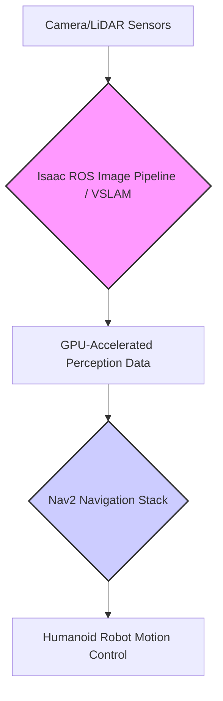

# Isaac ROS for Hardware-Accelerated VSLAM, Navigation

NVIDIA Isaac ROS is a collection of ROS 2 packages that leverage NVIDIA GPUs to provide hardware-accelerated performance for key robotics functionalities, including Visual Simultaneous Localization and Mapping (VSLAM) and navigation. By offloading computationally intensive tasks to the GPU, Isaac ROS significantly improves the real-time capabilities of robotics applications, especially for complex humanoid robots.

## Visual SLAM (VSLAM) with Isaac ROS

VSLAM is a technique that allows a robot to simultaneously build a map of its surroundings while localizing itself within that map, using visual information from cameras. Isaac ROS provides highly optimized VSLAM capabilities:

-   **Visual Odometry (VO)**: Estimates the robot's motion from a sequence of camera images.
-   **Graph SLAM**: Optimizes the robot's trajectory and map by building a pose graph and minimizing errors.
-   **Loop Closure**: Detects previously visited locations to correct accumulated errors in the map and trajectory.

### Isaac ROS VSLAM Advantages

-   **GPU Acceleration**: Utilizes NVIDIA GPUs for parallel processing of image data, leading to significantly higher frame rates and lower latency compared to CPU-only solutions.
-   **Real-time Performance**: Enables VSLAM to run in real-time on edge devices like NVIDIA Jetson platforms, crucial for autonomous navigation.
-   **Robustness**: Designed to handle various environmental conditions and sensor noise.

## Navigation with Isaac ROS

Isaac ROS enhances the capabilities of the ROS 2 Navigation Stack (Nav2) by providing accelerated components for perception and localization, which are critical inputs for path planning and motion control.

### Key Isaac ROS Components for Navigation

-   **`isaac_ros_image_pipeline`**: Provides GPU-accelerated image processing nodes, including rectification, resizing, and color conversion, which are foundational for camera-based perception.
-   **`isaac_ros_stereo_image_proc`**: Accelerates stereo matching to generate high-quality depth maps from stereo cameras, vital for obstacle detection and 3D reconstruction.
-   **`isaac_ros_nitros`**: NVIDIA Isaac Transport for ROS (NITROS) is a framework for efficient inter-process communication that minimizes data copying and latency, enabling high-performance data transfer between GPU-accelerated nodes.

### Integration with Nav2

Isaac ROS components seamlessly integrate with Nav2. For instance, the GPU-accelerated depth maps from `isaac_ros_stereo_image_proc` can directly feed into Nav2's costmap generation, improving the accuracy and speed of obstacle avoidance and path planning. Similarly, precise localization from VSLAM is a direct input for Nav2's global and local planners.

By leveraging Isaac ROS, developers can achieve unparalleled performance in perception and navigation tasks, enabling humanoid robots to operate autonomously and intelligently in complex, dynamic environments.
